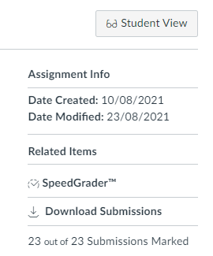

# Canvas Assignment Details

### What does it do?
Adds an assignment info section to the right hand side of the assignment page, above the related items section.

### Why?
I was tasked with coming up with a solution to easily show teachers when an assignment was initially created and last updated. This is easily found using the API, but not displayed anywhere on the assignment page.

### How?
The JavaScript uses the [Canvas Assignments API](https://canvas.instructure.com/doc/api/assignments.html#method.assignments_api.show) to get the *created_at* and *updated_at* date/time for the assignment. No API keys are necessary, as it runs in the context of the user logged in. It is only visible to users with the *teacher* or *admin* role, meaning it will not display for students / observers.

### Installation
Add the code in the JavaScript file to your existing Canvas LMS theme, or upload this file if you do not currently have any JavaScript files in your theme.

